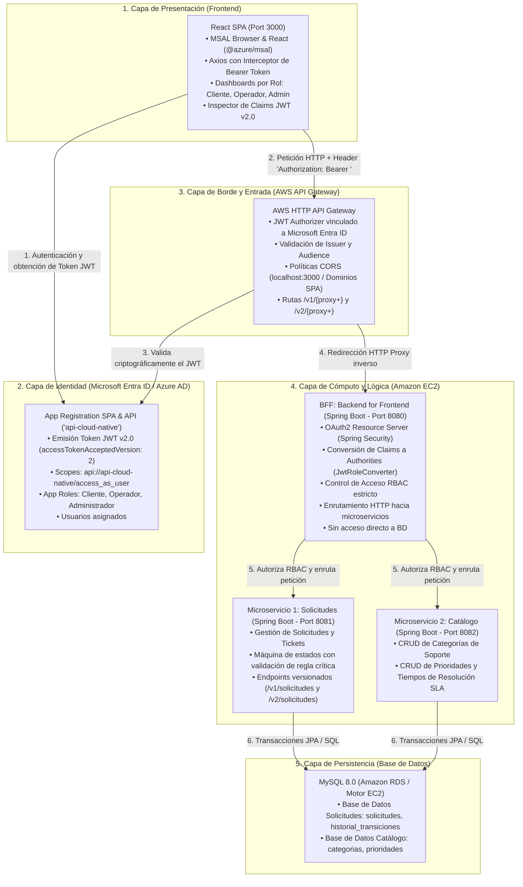
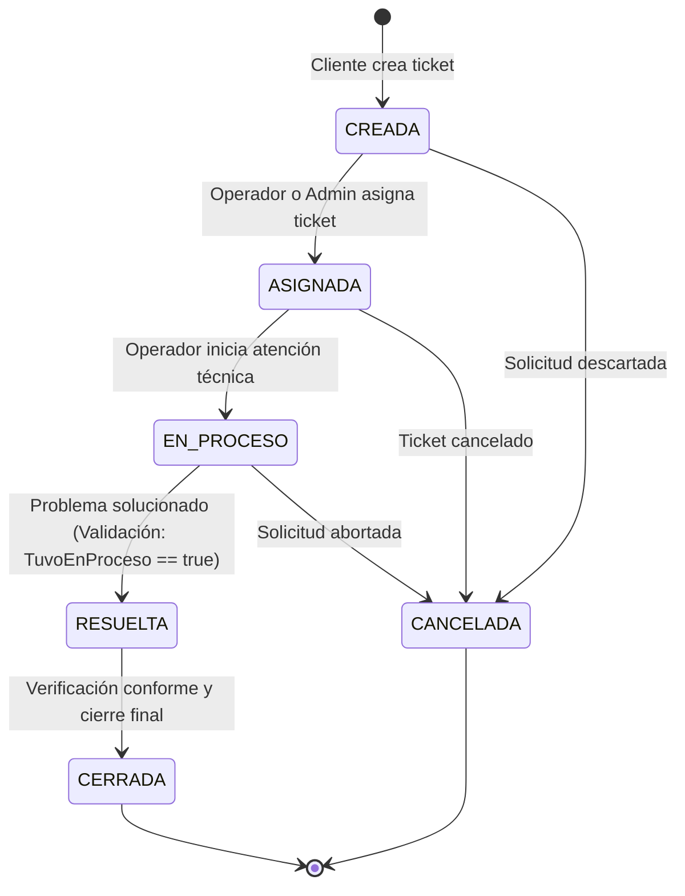

# Especificación de Arquitectura de la Solución - MesaTech Cloud

Este documento detalla la arquitectura de software e infraestructura cloud-native desarrollada para dar cumplimiento al 100% del caso de negocio **MesaTech Cloud**.

---

## 1. Diagrama de Arquitectura General

---

## 2. Diagrama de la Máquina de Estados (Microservicio 1: Solicitudes)

El microservicio de solicitudes implementa el flujo de vida estricto del ticket y la regla de negocio de control de calidad:

> [!CAUTION]
> **Regla de Negocio Crítica Implementada:**
> El sistema **impide** transicionar directamente de `CREADA` o `ASIGNADA` a `RESUELTA`. Si no se ha registrado previamente el paso por `EN_PROCESO`, el backend arroja un código HTTP `422 Unprocessable Entity` con el mensaje: *"Regla de negocio infringida: Una solicitud no puede pasar a estado RESUELTA si antes no pasó por EN_PROCESO."*

---

## 3. Detalle de Componentes por Capa

### A. Capa de Identidad (Microsoft Entra ID)
- **Tenant:** Microsoft Entra ID (Single Tenant).
- **API `api-cloud-native`:** Expone el scope `api://api-cloud-native/access_as_user` y define en su manifiesto los roles `Cliente`, `Operador` y `Administrador` bajo formato v2.0 (`accessTokenAcceptedVersion: 2`).
- **SPA `mesatech-spa-react`:** Registrada con plataforma Single-Page Application, otorgando consentimientos delegados y redirecciones hacia `http://localhost:3000`.

### B. Capa de Borde (AWS API Gateway)
- **Tipo de API:** HTTP API (AWS API Gateway v2).
- **Autorizador JWT:** Valida la firma del token contra las llaves públicas publicadas en el endpoint OpenID Connect de Entra ID (`https://login.microsoftonline.com/<tenant>/v2.0`). Verifica que la audiencia (`aud`) coincida con `api://api-cloud-native`.
- **CORS:** Gestionado en el borde para permitir peticiones `OPTIONS`, `GET`, `POST`, `PUT`, `DELETE` con orígenes autorizados, evitando sobrecargar al backend.

### C. Capa de BFF (Backend for Frontend)
- **Puerto:** `8080`.
- **Framework:** Spring Boot 3.2.4 con Java 25.
- **Seguridad:** Spring Security con OAuth2 Resource Server.
- **Decodificador y Conversor:** `JwtRoleConverter` lee el claim `roles` del JWT y lo proyecta a `GrantedAuthority` (`ROLE_Cliente`, `ROLE_Operador`, `ROLE_Administrador`).
- **Aislamiento Arquitectónico:** El BFF carece deliberadamente de dependencias de persistencia y drivers JDBC; cualquier consulta a datos la realiza vía HTTP hacia los microservicios internos.

### D. Capa de Microservicios Internos
- **Microservicio 1 - Solicitudes (`mesatech-solicitudes`):** Puerto `8081`. Gestiona el ciclo de vida de los requerimientos, auditoría de transiciones y proporciona versionamiento con `/v1/solicitudes` y `/v2/solicitudes` (modelo enriquecido con SLA dinámico y cálculo de tiempo transcurrido).
- **Microservicio 2 - Catálogo (`mesatech-catalogo`):** Puerto `8082`. Expone operaciones CRUD para categorías y prioridades de atención técnica.

### E. Capa de Persistencia
- **Motor:** MySQL 8.0.
- **Esquemas:** `mesatech_solicitudes_db` y `mesatech_catalogo_db`.
- **Despliegue:** Respaldado en Amazon RDS con alta disponibilidad y backups continuos, con alternativa en contenedor EC2 para entornos de evaluación.
